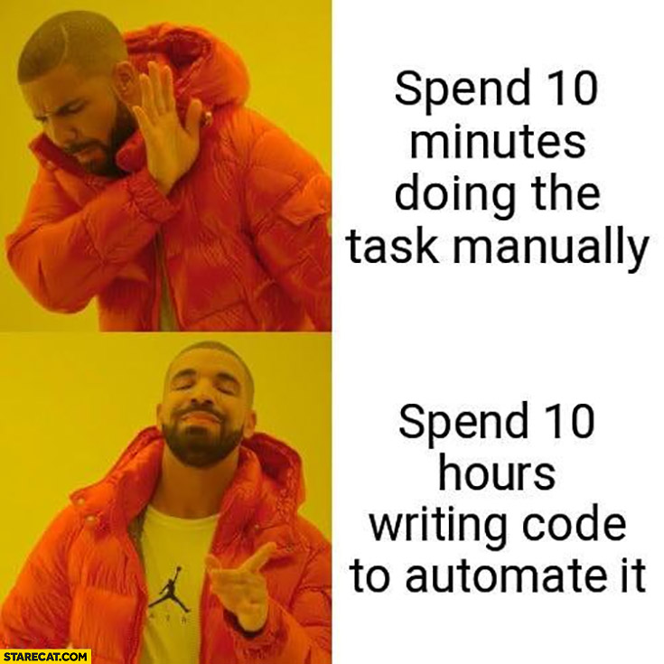

# vzctl

A command-line tool for managing environment variables and nodes on [Virtuozzo Application Platform](https://www.virtuozzo.com/application-management-docs/) (formerly Jelastic) — works with any PaaS provider running on Virtuozzo.

---

## Why This Exists

Recently, I was working on deploying a Django project on [Yeti Cloud](https://datahub.com.np/yeti-cloud/) i.e. based on [Virtuozzo Application Platform](https://www.virtuozzo.com/application-management-docs/). The web dashboard is painful to use. Every time you need to update an ENVIRONMENT variable, you have to log in, navigate to the right environment, click into each node one by one, and manually edit values. Miss a node and your app is broken. Do it across staging and production and it becomes a very time consuming process so I wasted more time and made this CLI tool.

[](https://starecat.com/spend-10-minutes-doing-the-task-manually-vs-spend-10-hours-writing-code-to-automate-it-drake/)

I built `vzctl` to fix that. Define your variables once in a `config.yaml` file and push them to every node in one command. It works with any PaaS built on Virtuozzo.

---

## Features

| Command          | Description                                                   |
| ---------------- | ------------------------------------------------------------- |
| `vzctl sync`     | Push all variables from `config.yaml` to every node           |
| `vzctl list`     | Display current variables on nodes; optionally export to CSV  |
| `vzctl delete`   | Delete a variable from every node in an environment           |
| `vzctl restart`  | Restart all nodes or specific nodes                           |
| `vzctl deploy`   | Redeploy nodes by pulling a new image (default tag: `latest`) |
| `vzctl logs`     | Fetch and display log files from nodes                        |

---

## Getting Started

### 1. Prerequisites

- Python 3.13+
- [uv](https://docs.astral.sh/uv/) — install with `curl -LsSf https://astral.sh/uv/install.sh | sh`

### 2. Clone and install

```bash
git clone <repo-url>
cd vzctl
uv sync
```

### 3. Get your API token

Log in to your Virtuozzo PaaS dashboard. Your session token is available under account settings or in the browser's developer tools after login.

### 4. Create your config

```bash
cp example-config.yaml config.yaml
```

Open `config.yaml` and fill in your `api_url`, `api_token`, environment names, node IDs, and variables. `config.yaml` is gitignored — it holds your secrets and should never be committed.

### 5. Run your first command

```bash
uv run vzctl sync --env staging
```

---

## Configuration

```yaml
# Global defaults — apply to all environments unless overridden per-environment
api_url: "https://app.your-paas-provider.cloud"
api_token: "your-api-session-token"

environments:
  staging:
    name: my-app-staging
    # api_url: "https://other.cloud"   # optional per-environment override
    # api_token: "env-specific-token"  # optional per-environment override
    nodes:
      - id: 10001
        nickname: api
      - id: 10002
        nickname: celery
      - id: 10003
        nickname: beat
    variables:
      DEBUG: "True"
      DJANGO_ENV: staging
      SECRET_KEY: "your-secret-key"

  production:
    name: my-app-production
    nodes:
      - id: 10004
        nickname: api
      - id: 10005
        nickname: celery
    variables:
      DEBUG: "False"
      DJANGO_ENV: production
      SECRET_KEY: "your-secret-key"
```

Node IDs are the numeric identifiers shown next to each container in your PaaS dashboard. Nicknames are labels you choose — they appear in command output to make it clear which node is which.

`api_url` and `api_token` can be set globally, per-environment, or both — per-environment values take precedence.

---

## Usage

```bash
# Push all variables from config.yaml to every node in staging
uv run vzctl sync --env staging

# Push to production
uv run vzctl sync --env production

# List variables currently set on all nodes
uv run vzctl list --env staging

# Export variables to a CSV file
uv run vzctl list --env staging --output vars.csv

# Delete a variable from all nodes
uv run vzctl delete --env staging --key SECRET_KEY

# Delete without confirmation prompt
uv run vzctl delete --env staging --key SECRET_KEY --yes

# Restart all nodes in staging (prompts for confirmation)
uv run vzctl restart --env staging

# Restart specific nodes by nickname
uv run vzctl restart --env staging --node api --node celery

# Restart without confirmation prompt
uv run vzctl restart --env staging --yes

# Redeploy all nodes with the latest image (prompts for confirmation)
uv run vzctl deploy --env staging

# Redeploy specific nodes
uv run vzctl deploy --env staging --node api --node celery

# Redeploy with a specific image tag
uv run vzctl deploy --env staging --tag v1.2.3

# Redeploy without confirmation prompt
uv run vzctl deploy --env staging --yes

# Fetch logs from all nodes (default: /var/log/run.log)
uv run vzctl logs --env staging

# Fetch logs from a specific node
uv run vzctl logs --env staging --node api

# Fetch last 50 lines from a custom log path
uv run vzctl logs --env staging --path /var/log/nginx/error.log --count 50

# Save logs to files (one file per node: <nickname>_<id>.log)
uv run vzctl logs --env staging --output ./logs

# Use a config file at a custom path
uv run vzctl sync --env staging --config /path/to/config.yaml
```

---

## How It Works

Each command calls the Virtuozzo PaaS REST API on your provider's host:

```text
POST <api_url>/1.0/environment/control/rest/<action>
```

A response with `"result": 0` means success. Results are displayed per-node in a table showing the node nickname and ID, so you always know exactly which nodes succeeded or failed.
